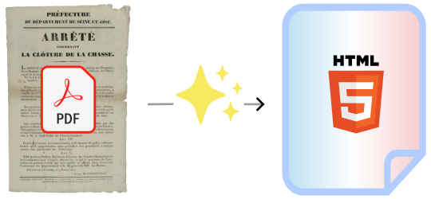

# Arrêtify



<br/>

**Arrêtify** est une librairie Python permettant le traitement automatique des arrêtés préfectoraux français. Elle permet de traduire des arrêtés préfectoraux depuis le format pdf vers des documents de données semi-structurées au format HTML ([un exemple](https://mte-dgpr.github.io/arretify/examples/arretes_html/arretes_icpe/0005801105/2023-03-30_AP_mistral.html), [un autre exemple](https://mte-dgpr.github.io/arretify/examples/arretes_html/arrete_circulation_mistral.html)).

Arrêtify features : 
- **Ségmentation de l'arrêté** : titre, vu / considérants, articles, annexes, etc.
- **HTML augmenté** de données supplémentaires : opération de modifications, etc.
- **Détection de références** : droit français, droit européeen et autres arrêtés préfectoraux
- **Entièrement modulaire et customizable**
- **Intégration avec solutions d'OCR** sur étagère : Mistral

Cas d'usage : RAG, indexation, liseuse ergonomique d'arrêtés, etc.

*ATTENTION : Arrêtify est actuellement en statut **ALPHA** et en phase de développement actif. Nous vous invitons à l'essayer, à nous faire vos retour et accueillons aussi toute contribution. En revanche nous vous déconseillons pour l'instant de l'utiliser en production.*


## Démarrage rapide

Installation : 

```python
# **NOTE**: La librairie sera disponible très prochainement sur PyPI. En attendant, vous pouvez l'installer directement depuis le repo git.
pip install git+https://github.com/mte-dgpr/arretify.git
```

### Avec le CLI

```bash
arretify -i /path/to/ocr.md -o /path/to/output.html
```

Pour directement convertir un document pdf, il vous faudra configurer votre clé mistral. [Voir la partie configuration](#configuration).


### Avec la librairie

Convertir un document markdown (résultat d'une opération d'OCR) en HTML: 

```python
from pathlib import Path
from arretify.pipeline import save_html_file, run_pipeline, load_ocr_file
from arretify.types import SessionContext
from arretify.settings import Settings

save_html_file(
    Path('/path/to/output.html'),
    run_pipeline(
        load_ocr_file(
            SessionContext(settings=Settings()),
            Path('/path/to/ocr.md'),
        )
    ),
)
```

<a id="configuration"></a>
## Configuration

La librairie se configure avec des variables d'environnement. Vous pourrez par exemple créer un fichier `.env` avec les variables suivantes : 

```bash
# Si vous voulez utiliser Mistral OCR
MISTRAL_API_KEY ='<MISTRAL_API_KEY>'

# Si vous voulez utiliser la résolution de références 
# aux textes de droit français.
LEGIFRANCE_CLIENT_ID = '<LEGIFRANCE_CLIENT_ID>'
LEGIFRANCE_CLIENT_SECRET = '<LEGIFRANCE_CLIENT_SECRET>'

# Si vous voulez utiliser la résolution de références
# aux textes de droit européen.
EURLEX_WEB_SERVICE_USERNAME = '<EURLEX_WEB_SERVICE_USERNAME>'
EURLEX_WEB_SERVICE_PASSWORD = '<EURLEX_WEB_SERVICE_PASSWORD>'

# Choix de l'environnement d'execution.
# Notez qu'en developpement tous les appels à API externe sont 
# récupérés depuis le cache (voir `law_data\dev_cache.py`)
ENV = 'development'
```

## CLI

Pour éxecuter le parsing sur un lot de fichiers OCRisés, copier le dossier de fichiers dans un dossier facilement accessible (e.g. `./tmp/arretes_ocr`), et exécuter la commande `main.py`. Par exemple :

```bash
python -m main -i ./tmp/arretes_ocr -o ./tmp/arretes_html
```

Il est aussi possible d'éxecuter le parsing sur un fichier unique en passant en option le chemin complet d'entrée et de sortie, par exemple :

```bash
python -m main -i ./tmp/arretes_ocr/bla.txt -o ./tmp/arretes_html/bla.html
```


## Developpement

### Setup

Créer un environnement virtuel :

```bash
py -3.13 -m venv venv
```

Installer la librairie et ses dépendances :

```bash
pip install .[dev]
```

Initialiser les sous-modules Git (qui se trouvent dans `arretify/_vendor`) : 

```bash
git submodule update --init --recursive
```

#### Outils de développement

La librairie utilise les outils suivants :
- `pytest` pour les tests
- `mypy` for static type-checking
- `black` pour le formattage de code automatique
- `flake8` et `flake8-bugbear` pour le linting
- `autoflake` pour la suppression automatique des imports inutilisés. Utilisation : 
    ```bash
    autoflake \
        --in-place \
        --recursive \
        --remove-all-unused-imports \
        --remove-unused-variables \
        --exclude=__init__.py \
        arretify scripts
    ```
- `licenseheaders` pour la gestion des en-têtes de licence dans les fichiers de code source.
- `pre-commit` pour la gestion des git pre-commit hooks

Afin d'initialiser les pre-commit hooks dans votre repository, lancer la commande suivante :

```bash
pre-commit install
```

Ainsi avant chaque commit un run des outils de linting sera executé pour vérifier le formattage et les fautes de style.


### Testing

Pour éxecuter les tests :

```bash
pytest
```

#### Snapshot testing

Le fichier `arretify/main_test.py` permet de détecter les regressions en effectuant le parsing sur tous les documents de notre base de tests de documents dans `arretes_ocr/` et en comparant le résultat obtenu avec des résultats obtenus précédemment et stocké dans `arretes_html/`.

Si les tests échouent c'est que la génération d'html a changé. Il convient donc de vérifier que c'est bien une évolution voulue et non une régression. Pour ça voici une proposition de process :

1. Re-générer les fichiers html de référence en utilisant la commande `python -m arretify.main -i test_data/arretes_ocr -o test_data/arretes_html`
2. Utiliser l'outil de diff de git (ou de vscodium) pour comparer la nouvelle version avec la version de référence
3. Régler les problèmes éventuels, puis répéter étape 1.


### Téléchargement des données de bases de droit

Afin de parser et résoudre les références citées dans les AP à des textes du droit français ou européen, nous téléchargeons grâce à divers scripts des fichiers contenant des listes de références à vérifier. Les fonctionalités pour accéder à ces références se trouvent dans le dossier `arretify/law_data`, les scripts se trouvent dans le dossier `scripts`.

Pour utiliser ces scripts, il faut installer et configurer la librairie du Data Studio Risques `py-clients-api-droit`.

#### Légifrance

Télécharger la liste des codes :

```bash
python ./scripts/download_data_legifrance.py -o ./arretify/law_data/legifrance
```
